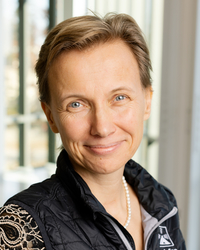

# [IEEE VIS Panel] Molecules to Humankind: Challenges in Multiscale Visualization

Andreas Bueckle1, Christiane V. R. Hütter2,3, Jörg Menche2,3,4,5, Katy Börner1,6

1 Department of Intelligent Systems Engineering, Luddy School of Informatics, Computing, and Engineering, Indiana University, Bloomington, IN, USA\
2 Ludwig Boltzmann Institute for Network Medicine, University of Vienna, Vienna, Austria\
3 Department of Structural and Computational Biology, Max Perutz Labs, University of Vienna, Vienna, Austria\
4 CeMM Research Center for Molecular Medicine of the Austrian Academy of Sciences, Vienna, Austria\
5 Faculty of Mathematics, University of Vienna, Vienna, Austria\
6 CIFAR MacMillan Multiscale Human, Canadian Institute for Advanced Research (CIFAR), Toronto, ON, Canada

# Time and Date
TBD

# Description of the Panel Topic
TBD

# Short Description of the Panel Format and Anticipated Schedule

TBD

# List of Prospective Panelists

# List of Organizers

**Andreas Bueckle, Ph.D.** ([https://andreas-bueckle.com](https://andreas-bueckle.com)), is the Research Lead in the Cyberinfrastructure for Network Science Center (CNS) at Indiana University. His research interest is information visualization in XR. He has a TEDx talk titled “Living and Learning in the Metaverse” (see [this YouTube video](https://www.youtube.com/watch?v=BpnLKoAK1YE)). He was awarded a R03 award (see [NIH Reporter](https://reporter.nih.gov/search/oQWN8hJ2EkWfCtqXHyTq0A/project-details/11123677)) as well as two JumpStart Fellowships ([https://hubmapconsortium.org/jumpstart-program/#andreas2024](https://hubmapconsortium.org/jumpstart-program/#andreas2024)) by the National Institutes of Health to advance multiscale exploration of the human body in VR with the HRA Organ Gallery ([https://humanatlas.io/hra-organ-gallery](https://humanatlas.io/hra-organ-gallery)).

**Christiane V. R. Hütter** is an architect and computational bioengineer as well as Ph.D. Candidate at the Ludwig Boltzmann Institute for Network Medicine, working on visual data exploration in immersive systems. Her work extends beyond disciplines, curating ([https://www.whatevr.xyz](https://www.whatevr.xyz)) and participating in various media art exhibitions ([https://ars.electronica.art/center/en/events/deep-space-experience-premiere-connected-how-the-world-is-morethan-the-sum-of-its-parts](https://ars.electronica.art/center/en/events/deep-space-experience-premiere-connected-how-the-world-is-morethan-the-sum-of-its-parts/)).

**Jörg Menche, Ph.D.**, is a professor at the University of Vienna, holding a dual appointment at the Max Perutz Labs and the Faculty of Mathematics, and is the director of the Ludwig Boltzmann Institute for Network Medicine. A physicist by training, his interdisciplinary team—spanning biology, bioinformatics, medicine, and the arts—leverages network theory to investigate molecular interactions underlying health and disease through cutting-edge technologies, from AI to VR.

**Katy Börner, Ph.D.**, is the Victor H. Yngve Distinguished Professor of Engineering and Information Science in the Department of Intelligent Systems Engineering, Core Faculty of Cognitive Science, and Founding Director of CNS at Indiana University. She is a curator of the international Places and Spaces exhibit ([https://scimaps.org](https://scimaps.org/)). She was elected as an American Association for the Advancement of Science (AAAS) Fellow in 2012, obtained an Alexander von Humboldt Fellowship in 2017, and a Stiftung Charité Visiting Fellowship in 2025. 

# Acknowledgments

This panel was made possible through support from the the [CIFAR MacMillan Multiscale Human program](https://cifar.ca/research-programs/cifar-macmillan-multiscale-human/).

# About

This companion website for the panel is maintained by the organizers. Juhi Khare contributed images.
